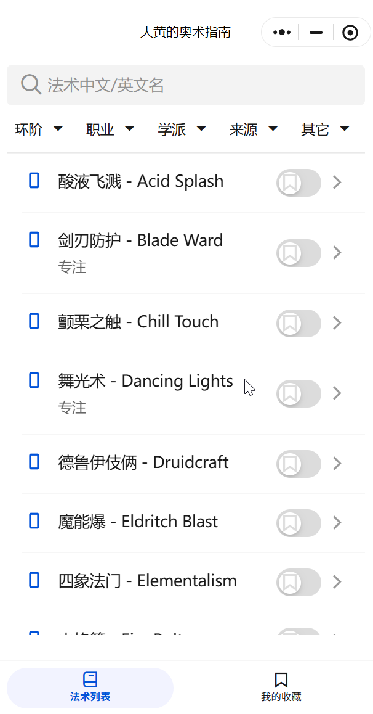
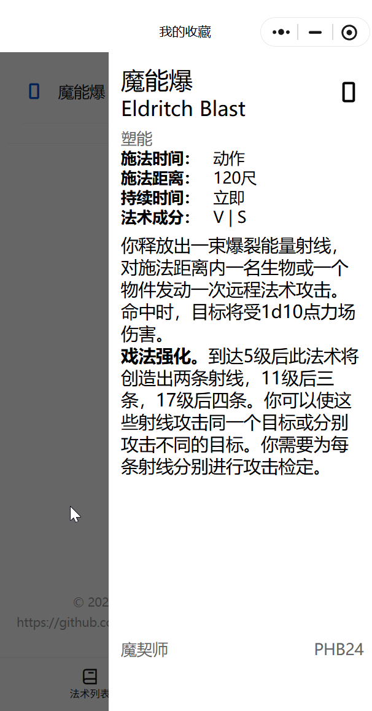
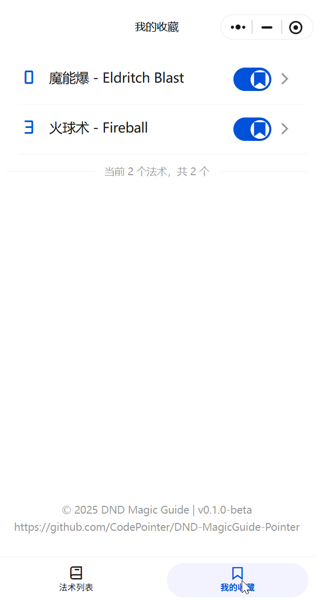

# 大黄的奥术指南 (DND Magic Guide Pointer)

<div align="center">
  
</div>

一个极简的法术查询器。基于微信小程序，提供 法术数据库 + 收藏法术 的功能。

如有问题或建议，请提交 [Issue](https://github.com/CodePointer/DND-MagicGuide-Pointer/issues)。


## 小程序预览

<div align="center">
  
</div>


## 功能特性

| 法术查询 | 法术详情 |
| :--: | :--: |
| 浏览和搜索D&D法术数据库，支持中英文查询 | 查看详细的法术描述、属性和使用条件 |
|  |  |
| **筛选功能** | **收藏功能** |
| 支持根据环位、职业、学派、来源筛选；支持仪式与专注施法筛选 | 收藏常用法术，便于快速访问。法术收藏永久化在服务器，方便多次开团使用 |
|  |  |


## 快速开始

如果你需要使用本项目，请设置配置文件：

```bash
# 复制云开发配置
copy config.template.js config.js

# 复制项目配置
copy project.config.template.json project.config.json

# 修改微信云开发环境ID以及小程序ID
```

如果要使用数据，请导入相应的json文件：

```
raw_data/all_spells.json
```


## 项目结构

```
├── app.js                     # 小程序主入口
├── app.json                   # 小程序配置文件
├── app.wxss                   # 全局样式
├── config.js                  # 云开发配置(需从template复制)
├── project.config.json        # 项目配置(需从template复制)
├── package.json               # 依赖管理
│
├── pages/                     # 页面目录
│   ├── spells/               # 法术列表页面
│   │   ├── spells.js
│   │   ├── spells.json
│   │   ├── spells.wxml
│   │   └── spells.wxss
│   ├── mine/                 # 我的收藏页面
│   └── common/               # 公共组件
│       ├── spell-card/       # 法术卡片组件
│       ├── spell-detail/     # 法术详情组件
│       ├── spell-list/       # 法术列表组件
│       └── spell-popup/      # 法术弹窗组件
│
├── custom-tab-bar/           # 自定义底部导航
├── cloudfunctions/           # 云函数
│   └── getOpenId/           # 获取用户OpenID
├── miniprogram_npm/          # npm依赖包
│   └── tdesign-miniprogram/ # TDesign组件库
└── raw_data/                 # 法术原始数据。来源5e不全书。
    ├── all_spells.json      # 所有法术数据
    ├── html2json.py         # 数据处理脚本
    └── spells/              # 分版本法术数据（修改了部分网页端的小错误）
        ├── PHB24/          # Player's Handbook 2024
        ├── XGE/            # Xanathar's Guide to Everything
        ├── TCE/            # Tasha's Cauldron of Everything
        ├── FTD/            # Fizban's Treasury of Dragons
        └── SCC/            # Strixhaven: A Curriculum of Chaos
```

## 数据来源

本项目中的法术数据来源于项目 [DND5eChm](https://github.com/DND5eChm/DND5e_chm)，更新时间2025-10-12。

| 缩写   | 资料书名称                              | 版本说明           |
|--------|----------------------------------------|-------------------|
| PHB24  | Player's Handbook                      | 2024年修订版      |
| XGE    | Xanathar's Guide to Everything         | 扩展规则书        |
| TCE    | Tasha's Cauldron of Everything         | 扩展规则书        |
| FTD    | Fizban's Treasury of Dragons           | 龙类主题扩展      |
| SCC    | Strixhaven: A Curriculum of Chaos     | 学院设定扩展      |


---

**注意**: 使用本项目前请确保您已阅读并同意相关的使用条款和版权声明。
